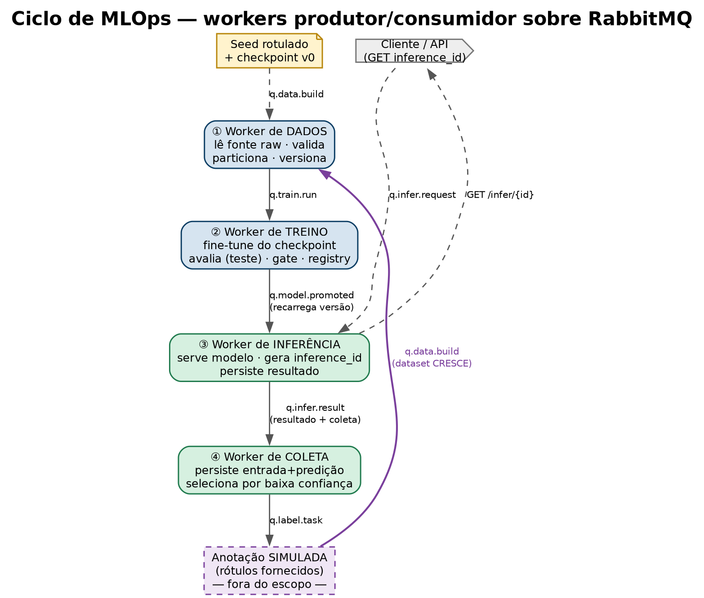
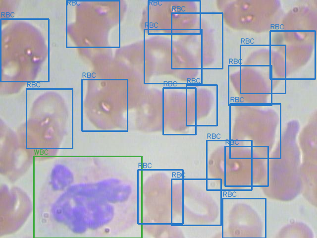

# Atividade — Pipeline de MLOps para um modelo de detecção

## Contexto

Você recebeu um modelo de **detecção de objetos já treinado** (um *checkpoint*
inicial, funcional) e os três códigos que sustentam seu ciclo de vida: **tratamento
de dados**, **treinamento** e **inferência**. Hoje esses códigos existem como
scripts soltos, rodados **à mão**, um de cada vez.

**Você NÃO começa com o dataset completo.** Você tem apenas um **seed pequeno** de
dados rotulados — o suficiente para o modelo inicial existir. O grosso do dataset
**não existe ainda**: ele será **coletado pela própria aplicação** em produção. A
cada imagem que passa pela inferência, casos úteis são capturados, rotulados e
**incorporados ao dataset**, que **cresce a cada ciclo**.

O seu objetivo é transformar os scripts em um **pipeline de MLOps automatizado**,
onde cada fase é um serviço independente que se comunica por **mensagens**
(arquitetura **produtor/consumidor**), de modo que o ciclo *dado → treino →
inferência → coleta → mais dado* rode sozinho, **engorde o dataset** e seja
rastreável.

O domínio é proposital: você instancia o pipeline sobre o dataset público de
**detecção de células sanguíneas (BCCD)**, mas a arquitetura não pode depender do
domínio — trocar o dataset não deve mudar o pipeline.

> O problema **não** é treinar um modelo melhor de uma vez. É **manter o ciclo de
> vida do modelo rodando**: partir de um seed pequeno + um modelo inicial e fazer o
> dataset (e o modelo) **melhorarem sozinhos** conforme a aplicação coleta dados.

---

## Objetivo da tarefa

Construir um **pipeline de MLOps de ponta a ponta**, orientado a mensagens
(produtor/consumidor sobre **RabbitMQ**), em que cada uma das fases é um **worker**
independente:

1. **Tratamento de dados** — lê uma **fonte raw única** (que cresce a cada ciclo,
   pois a anotação escreve nela), valida, **particiona** (treino / validação /
   **teste**) e versiona o dataset.
2. **Treinamento** — **fine-tune a partir do checkpoint** vigente sobre o dataset
   novo, avalia no **conjunto de teste**, aplica um **gate de qualidade** e registra
   o modelo versionado.
3. **Inferência** — serve o modelo como serviço, com contrato estável e versão
   rastreável.
4. **Coleta** — captura as entradas e predições do serviço, seleciona casos a
   anotar e **realimenta** a fase de dados, fechando o ciclo.

> **A etapa de anotação humana (corrigir as predições) NÃO precisa ser
> implementada** — é manual por natureza. Em vez disso, a anotação é **simulada**:
> os dados já rotulados são **fornecidos** ao pipeline (no BCCD, os rótulos
> escondidos do *stream*) e reentram no dataset como se um anotador os tivesse
> corrigido. O que você implementa é a *seleção* dos casos e a *reincorporação* dos
> rótulos — não a ferramenta de correção.

A comunicação entre fases é feita **só por filas** — uma fase publica o resultado,
a próxima consome. Nenhuma fase chama a outra diretamente.



*Ciclo de MLOps modelado (o que deve ser implementado). As setas são as filas
RabbitMQ; a aresta roxa é o loop de feedback que reincorpora os rótulos fornecidos
e faz o dataset crescer a cada volta. A anotação (tracejada) fica fora do escopo.*

### Fase 1 — MVP (obrigatório)

O mínimo para o **ciclo existir e fechar**:

- [ ] **Broker de mensagens** (RabbitMQ) no ar, com as filas das 4 fases.
- [ ] **Dados iniciais + modelo inicial**: a fonte raw começa com um pouco de dado rotulado e um checkpoint inicial já registrado como `v0`.
- [ ] **Worker de Dados**: consome um gatilho, lê a **fonte raw atual**, valida + **particiona** (treino/val/**teste**), **versiona** o dataset e publica o evento de treino.
- [ ] **Worker de Treino**: consome o evento, **fine-tune do checkpoint vigente**, **avalia no conjunto de teste**, aplica **gate** (só promove se ≥ baseline) e **registra a versão do modelo**.
- [ ] **Worker de Inferência**: serve a versão promovida; recebe imagem → **gera um `inference_id` único** → devolve detecções; persiste o resultado por `inference_id` (recuperável depois); expõe **healthcheck** + versão do modelo.
- [ ] **Worker de Coleta**: persiste entrada + predição de cada inferência; seleciona casos por **baixa confiança**; marca-os como candidatos a anotação.
- [ ] **Reincorporação (anotação simulada)**: rótulos **fornecidos** para os casos selecionados são injetados e voltam ao Worker de Dados, disparando um novo ciclo. *(A correção humana em si fica fora do escopo.)*
- [ ] **Loop fechado** demonstrável ponta a ponta.
- [ ] **Reprodutibilidade básica**: tudo sobe via `docker-compose`; o modelo em produção é rastreável até a versão de dados que o gerou.

### Fase 2 — API de controle do pipeline (diferencial)

Expor uma **API REST** que é o **plano de controle** do pipeline: por ela é
possível **disparar cada fase** (a API publica nas filas) e **recuperar o resultado
de uma inferência**. Tira a operação do terminal e a torna programática e auditável.

**Disparar fases (POST → publica na fila correspondente):**

| Endpoint | Ação | Publica em |
|---|---|---|
| `POST /pipeline/data` | inicia um build de dataset | `q.data.build` |
| `POST /pipeline/train` | dispara treino de uma versão de dataset | `q.train.run` |
| `POST /pipeline/infer` | envia imagem para inferência; **retorna o `inference_id`** | `q.infer.request` |
| `POST /pipeline/labels` | injeta rótulos fornecidos (anotação simulada) → novo ciclo | `q.data.build` |

A resposta do `POST /pipeline/infer` traz o `inference_id` gerado pelo Worker de
Inferência; com ele o cliente recupera o resultado quando ficar pronto (a inferência
é assíncrona, via fila).

**Recuperar resultado (GET):**

| Endpoint | Retorna |
|---|---|
| `GET /infer/{inference_id}` | **resultado de uma inferência** (status + detecções + versão do modelo) |

```jsonc
// GET /infer/inf-3b9c1e0a  (exemplo)
{ "inference_id": "inf-3b9c1e0a", "status": "done", "model_version": "m-003",
  "detections": [ { "cls": "RBC", "conf": 0.91, "box": [346, 361, 446, 454] } ] }
```

---

## Contratos das mensagens (entrada/saída dos workers)

Cada worker **consome** uma mensagem de uma fila e **produz** outra na fila
seguinte. As mensagens são envelopes JSON pequenos: carregam **referências por
URI + versões**, nunca o dado bruto (que vive no armazenamento). A versão viaja
junto → rastreabilidade automática.

### Worker de Dados
Consome `q.data.build` → produz `q.train.run`.
```jsonc
// IN  (q.data.build)
{ "event": "data.build", "trigger": "manual | feedback",
  "raw_uri": "s3://raw/",                       // fonte ÚNICA (cresce a cada ciclo)
  "params": { "val_frac": 0.15, "test_frac": 0.15 } }

// OUT (q.train.run)  — lê a fonte raw atual; ela cresceu desde o último ciclo
{ "event": "train.run", "dataset_version": "ds-003",
  "dataset_uri": "s3://datasets/ds-003/",
  "classes": ["RBC", "WBC", "Platelets"],
  "counts": { "train": 180, "val": 38, "test": 38 },
  "added_this_cycle": 42 }                       // novas amostras desde o último build
```

### Worker de Treino
Consome `q.train.run` → produz `q.model.promoted` (só se passar no gate).
```jsonc
// IN  (q.train.run)  -> idem OUT acima

// OUT (q.model.promoted)  — fine-tune a partir do checkpoint anterior
{ "event": "model.promoted", "model_version": "m-003",
  "base_model": "m-002",                       // checkpoint de onde partiu
  "model_uri": "s3://models/m-003/model.onnx",
  "dataset_version": "ds-003",
  "metrics":  { "mAP50": 0.91, "per_class": { "RBC": 0.93, "WBC": 0.88, "Platelets": 0.79 } },
  "baseline": { "mAP50": 0.88 }, "promoted": true }
```

### Worker de Inferência
Consome `q.infer.request` → produz **um único evento** `q.infer.result`. Esse mesmo
evento serve de **duas formas**: é o **resultado** (recuperável via
`GET /infer/{inference_id}`) **e** é o **evento de coleta** consumido pelo Worker de
Coleta. **O worker gera um `inference_id` único** (ex.: UUID) — a chave que liga
tudo.
```jsonc
// IN  (q.infer.request)  — sem id do cliente; o worker é quem cria o inference_id
{ "image_uri": "s3://inbox/img-9f2.jpg", "model_version": "production" }

// OUT (q.infer.result)  — resultado E evento de coleta no MESMO payload
{ "inference_id": "inf-3b9c1e0a", "model_version": "m-003", "status": "done",
  "image_uri": "s3://inbox/img-9f2.jpg", "latency_ms": 23, "min_conf": 0.87,
  "ts": "2025-06-15T12:00:00Z",
  "detections": [ { "cls": "RBC", "conf": 0.91, "box": [346, 361, 446, 454] },
                  { "cls": "WBC", "conf": 0.87, "box": [68, 315, 286, 480] } ] }
```

### Worker de Coleta
Consome `q.infer.result` → marca casos como candidatos a anotação (`q.label.task`).
A anotação é **simulada**: os rótulos **fornecidos** para esses casos são **escritos
na fonte raw** e o worker publica `q.data.build`, fechando o loop. *(A correção
humana não é implementada.)*
```jsonc
// IN  (q.infer.result)  -> idem OUT do Worker de Inferência

// OUT (q.label.task)  — caso selecionado, aguardando rótulo fornecido
{ "task_id": "lbl-77", "image_uri": "s3://inbox/img-9f2.jpg",
  "model_version": "m-003", "reason": "low_confidence", "min_conf": 0.41 }

// rótulo FORNECIDO (anotação simulada) -> publica q.data.build
{ "task_id": "lbl-77", "image_uri": "s3://inbox/img-9f2.jpg",
  "labels": [ { "cls": "WBC", "box": [70, 318, 280, 476] } ] }
```

---

## Dados disponibilizados — BCCD

O dataset **BCCD (Blood Cell Count and Detection)** é público e de detecção de
objetos em imagens de microscopia de esfregaço sanguíneo.

| Atributo | Valor |
|---|---|
| Tarefa | detecção de objetos (bounding box) |
| Classes | **RBC** (hemácias), **WBC** (leucócitos), **Platelets** (plaquetas) |
| Imagens | ~364 (≈ 4.9k células rotuladas) |
| Resolução | 640×480 |
| Formato | YOLO (via Roboflow) / Pascal VOC XML (origem) |
| Licença | MIT |



*Exemplo real do BCCD (`BloodImage_00001`): 18 hemácias (RBC, azul) e 1 leucócito
(WBC, verde) anotados por bounding box. As plaquetas (Platelets) aparecem em outras
imagens do conjunto.*

### Como o BCCD é usado nesta atividade

Você **não** usa o dataset inteiro de uma vez. Divida o BCCD em dois papéis para
**simular o crescimento do dataset pela coleta**:

| Papel | Fatia sugerida | Uso |
|---|---|---|
| **Seed** (bootstrap) | ~10–20% das imagens (rotuladas) | treina o modelo inicial `v0`; é o pouco que você "já tem" |
| **Stream** (chegada) | o restante, **sem rótulo visível** | alimentado ao serviço de inferência como "imagens novas"; é o que a aplicação vai **coletar** |

> Os rótulos reais do *stream* existem no BCCD, mas ficam **escondidos** — são
> revelados só na etapa de anotação (o **oráculo** que substitui a correção humana)
> e então **escritos na fonte raw**, que assim **cresce**. O *seed* é só o conteúdo
> inicial dessa mesma fonte. Assim o loop completo (coleta → rótulo → fonte cresce →
> retreina) é demonstrável de ponta a ponta usando um dataset estático.

Características úteis:
- **Pequeno** → o ciclo completo roda em **CPU em minutos** (loop demonstrável ao vivo).
- **Desbalanceado** (RBC ≫ WBC ≈ Platelets) → exercita **validação de balanço** e
  **gate por classe**.
- **Substituível** → trocar por outro dataset de detecção só muda a fonte do Worker
  de Dados, não a arquitetura.

---

## Entrega

Publique em um **repositório público (ou privado com acesso concedido)** no GitHub /
GitLab. Inclua:

1. **`README.md`** — guia de reprodução:
   - ferramentas usadas e o porquê;
   - como subir tudo (`docker-compose up`) e como disparar um ciclo completo.
2. **Código dos 4 workers** + definição das filas (produtor/consumidor).
3. **`docker-compose.yml`** subindo RabbitMQ + os workers + dependências.
4. **Diagrama da arquitetura** (filas, workers, fluxo do loop).
5. **Demonstração do loop fechado** — script/comando ou vídeo curto mostrando
   `dados → treino → inferência → coleta → rótulo → novo ciclo`.
6. **`relatorio.md`** — diário de bordo do processo de construção.

### Sugestão de seções do `relatorio.md`

1. **Visão geral do problema** — contexto e quais decisões de arquitetura você
   priorizou primeiro e por quê.
2. **Arquitetura** — as 4 fases como produtor/consumidor; desenho das filas;
   contrato das mensagens; por que mensageria em vez de chamadas diretas.
3. **Pipeline de dados** — ingestão, validação, particionamento (treino/val/teste),
   versionamento.
4. **Treino + gate** — métricas escolhidas, critério de promoção, registro de modelo.
5. **Inferência + coleta** — contrato do serviço, o que é coletado, como o loop fecha.
6. **Resultados** — o ciclo rodando ponta a ponta; o que foi MVP vs. Fase 2.
7. **Limitações e próximos passos** — o que faltou; o que faria com mais tempo/dados.

---

## Dicas

- **Mensageria:** RabbitMQ — a imagem `rabbitmq:management` já traz um **painel web**
  para você ver as filas e a profundidade delas. Em Python, `pika` é suficiente.
  Comece com **filas duráveis + ack manual** (não precisa de mais que isso no MVP).
- **Modele as filas primeiro:** desenhe o fluxo de mensagens (quem publica, quem
  consome) antes de codar qualquer worker — é o esqueleto da atividade.
- **Simule o loop com o BCCD:** separe um pedaço pequeno como dado inicial e use o
  resto como "imagens novas". Os rótulos reais que já existem no BCCD são o
  **oráculo** que substitui a anotação humana — assim você fecha o ciclo sem
  construir ferramenta de rotulagem.
- **Comece pelo caminho feliz:** um ciclo único rodando ponta a ponta vale mais que
  cada peça perfeita isolada.

---

## Glossário

- **Produtor/Consumidor** — padrão em que um serviço *publica* mensagens numa fila e
  outro as *consome*, sem se conhecerem. Desacopla as fases.
- **Fila / Broker** — o RabbitMQ guarda e entrega as mensagens entre os workers.
- **Ack (acknowledgement)** — confirmação que o consumidor processou a mensagem; sem
  ack, a mensagem é reentregue.
- **Fonte raw** — o repositório único de dados rotulados que alimenta o treino; ele
  **cresce** a cada ciclo, conforme a anotação simulada escreve nele.
- **`inference_id`** — identificador único gerado pelo Worker de Inferência para cada
  inferência; é a chave para recuperar o resultado e ligá-lo ao evento de coleta.
- **Conjunto de teste** — partição **separada**, nunca usada em treino/validação; é
  a fonte de verdade da qualidade do modelo.
- **Gate de qualidade** — regra que só promove um modelo novo se ele for ≥ o
  baseline no conjunto de teste; senão, reprova.
- **Model Registry** — registro versionado de modelos, com estágio
  (candidato → produção) e rollback.
- **Anotação simulada** — em vez de um humano corrigir as predições, os rótulos já
  existentes (oráculo) são fornecidos aos casos selecionados e reentram na fonte raw.
