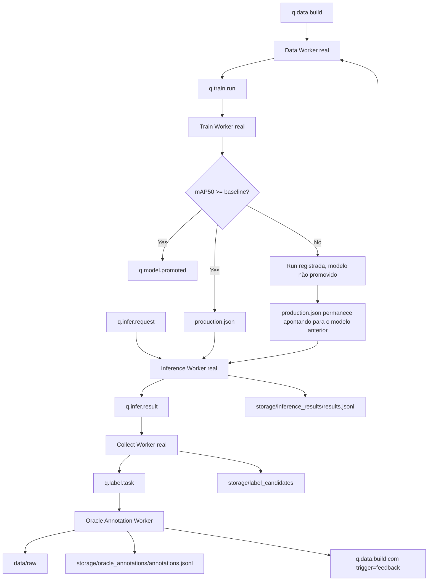

# MLOps Pipeline Challenge — Object Detection Lifecycle with RabbitMQ

Este projeto implementa um pipeline de MLOps orientado a mensagens para o ciclo de vida de um modelo de detecção de objetos.

A proposta é transformar scripts isolados de preparação de dados, treinamento e inferência em um pipeline com workers independentes, comunicando-se por filas RabbitMQ no padrão produtor/consumidor.

O domínio usado para instanciar o pipeline é o BCCD, um dataset de detecção de células sanguíneas com três classes:

```text
RBC
WBC
Platelets
```

O objetivo principal não é treinar o melhor modelo possível em uma única execução, mas sim modelar o ciclo de vida contínuo:

```text
dados → treino → promoção → inferência → coleta → anotação simulada → novos dados → novo treino
```

---

## 1. Visão geral

O pipeline parte de:

* uma fonte `raw` inicial pequena, usada como seed rotulado;
* um checkpoint inicial `v0`;
* imagens de stream, simulando dados novos chegando em produção;
* rótulos escondidos do stream, usados como oráculo na etapa de anotação simulada.

A cada ciclo, o sistema pode:

1. construir uma nova versão de dataset a partir da fonte `raw`;
2. treinar/fazer fine-tune de um modelo a partir do checkpoint vigente;
3. avaliar o modelo no conjunto de teste;
4. promover o modelo apenas se ele passar no gate de qualidade;
5. servir o modelo promovido para inferência;
6. coletar casos de baixa confiança;
7. simular a anotação desses casos usando os rótulos verdadeiros já existentes;
8. reinjetar imagem e label na fonte `raw`;
9. publicar automaticamente um novo `q.data.build` com `trigger="feedback"`;
10. iniciar um novo ciclo de dados e treino.

---

## 2. Ferramentas usadas

### Python

Usado para implementar os workers, scripts de dados, treino, inferência e ferramentas auxiliares.

### uv

Usado para gerenciar o ambiente Python e executar comandos de forma reprodutível.

Exemplo:

```powershell
uv run python src\workers\data_worker_real.py
```

### RabbitMQ

Usado como broker de mensagens entre as fases do pipeline.

Cada fase publica mensagens em uma fila e a próxima fase consome essas mensagens, evitando chamadas diretas entre workers.

### Docker Compose

Usado para subir o RabbitMQ com painel de gerenciamento.

```powershell
docker compose up -d
```

### Pydantic

Usado para definir contratos de mensagens entre os workers.

Em vez de processar dicionários soltos, os workers validam eventos como:

```text
DataBuildMessage
TrainRunEvent
ModelPromotedEvent
InferRequestEvent
InferResultEvent
LabelTaskEvent
```

### Ultralytics YOLO

Usado para treinar, validar e exportar o modelo de detecção de objetos.

### ONNX / ONNX Runtime

O modelo promovido é exportado para ONNX e usado pelo worker real de inferência.

---

## 3. Arquitetura

O pipeline é dividido em quatro fases principais:

```text
Data Worker
Train Worker
Inference Worker
Collect Worker
```

Além delas, há um worker auxiliar para anotação simulada:

```text
Oracle Annotation Worker
```

Esse worker representa a etapa de reincorporação dos rótulos fornecidos pelo oráculo. Ele não implementa uma ferramenta humana de anotação. Em vez disso, recupera os labels reais já existentes, injeta imagem + label de volta em `data/raw` e publica automaticamente um novo `q.data.build` com `trigger="feedback"`.

Assim, o loop de feedback é fechado automaticamente apenas depois que existe um novo exemplo anotado disponível na fonte `raw`.

---

## 4. Diagrama do fluxo



---

## 5. Filas RabbitMQ

As principais filas usadas são:

```text
q.data.build
q.train.run
q.model.promoted
q.infer.request
q.infer.result
q.label.task
```

### `q.data.build`

Entrada para o Data Worker.

Pode ser publicado manualmente, por exemplo no primeiro ciclo, ou automaticamente pelo `Oracle Annotation Worker` depois da anotação simulada.

Exemplo de mensagem manual:

```json
{
  "event": "data.build",
  "trigger": "manual",
  "raw_uri": "data/raw",
  "params": {
    "val_frac": 0.15,
    "test_frac": 0.15,
    "seed": 42
  }
}
```

Exemplo de mensagem automática de feedback:

```json
{
  "event": "data.build",
  "trigger": "feedback",
  "raw_uri": "data/raw",
  "params": {
    "val_frac": 0.15,
    "test_frac": 0.15,
    "seed": 42
  }
}
```

---

### `q.train.run`

Entrada para o Train Worker.

Exemplo de mensagem produzida pelo Data Worker:

```json
{
  "event": "train.run",
  "run_request_id": "train-xxxxxxx",
  "dataset_version": "ds-20260622-202001-870c13",
  "dataset_uri": "storage/datasets/ds-20260622-202001-870c13",
  "classes": ["RBC", "WBC", "Platelets"],
  "counts": {
    "train": 65,
    "val": 14,
    "test": 14
  },
  "added_this_cycle": 1
}
```

---

### `q.model.promoted`

Evento publicado pelo Train Worker apenas quando o modelo passa no gate de qualidade.

Exemplo:

```json
{
  "event": "model.promoted",
  "model_version": "model-20260622-182157-34ab11",
  "base_model": "model-20260622-160102-df2d2e",
  "model_uri": "storage/models/model-20260622-182157-34ab11",
  "dataset_version": "ds-20260622-172922-5d45af",
  "metrics": {
    "mAP50": 0.8552,
    "per_class": {}
  },
  "baseline": 0.5,
  "promoted": true
}
```

Se o modelo não passa no gate, a run é considerada executada, mas o modelo não é promovido. Nesse caso, `q.model.promoted` não é publicado e `production.json` continua apontando para o modelo anterior.

---

### `q.infer.request`

Entrada para o Inference Worker.

Exemplo:

```json
{
  "event": "infer.request",
  "image_uri": "data/stream/images/BloodImage_00000.jpg",
  "model_version": "production"
}
```

---

### `q.infer.result`

Resultado publicado pelo Inference Worker e consumido pelo Collect Worker.

Exemplo:

```json
{
  "event": "infer.result",
  "inference_id": "inf-da3eb216",
  "model_version": "model-20260622-160102-df2d2e",
  "status": "success",
  "image_uri": "data/stream/images/BloodImage_00000.jpg",
  "latency_ms": 75.17,
  "min_conf": 0.32289034128189087,
  "detections": [
    {
      "cls": "RBC",
      "conf": 0.9024,
      "box": [158.0, 76.0, 244.0, 170.0]
    }
  ]
}
```

---

### `q.label.task`

Fila de tarefas de anotação simulada.

Exemplo:

```json
{
  "event": "label.task",
  "label_task_id": "label-test-auto-feedback-001",
  "reason": "low_confidence",
  "inference_id": "inf-test-auto-feedback-001",
  "image_uri": "data/stream/images/BloodImage_00000.jpg",
  "model_version": "production",
  "min_conf": 0.30,
  "threshold": 0.50,
  "status": "pending_annotation"
}
```

---

## 6. Estrutura principal do projeto

```text
.
├── data/
│   ├── raw/
│   │   ├── images/
│   │   └── labels/
│   ├── stream/
│   │   └── images/
│   └── oracle/
│       └── labels/
│
├── models/
│   └── v0/
│       └── best.pt
│
├── scripts/
│   ├── demo_compose.ps1
│   └── demo_compose.sh
│
├── src/
│   ├── contracts/
│   │   └── messages.py
│   │
│   ├── messaging/
│   │   └── rabbitmq.py
│   │
│   ├── tools/
│   │   ├── check_inference_status.py
│   │   ├── get_inference_result.py
│   │   └── publish_data_build.py
│   │
│   ├── workers/
│   │   ├── data_worker_fake.py
│   │   ├── train_worker_fake.py
│   │   ├── infer_worker_fake.py
│   │   ├── collect_worker_fake.py
│   │   ├── data_worker_real.py
│   │   ├── train_worker_real.py
│   │   ├── infer_worker_real.py
│   │   ├── collect_worker_real.py
│   │   └── oracle_annotation_worker.py
│   │
│   ├── prep_data.py
│   ├── train.py
│   └── infer.py
│
├── storage/
│   ├── datasets/
│   ├── models/
│   ├── inference_results/
│   ├── label_candidates/
│   └── oracle_annotations/
│
├── .gitattributes
├── docker-compose.yml
├── README.md
└── relatorio.md
```


---

## 7. Como subir o RabbitMQ

Na raiz do projeto, execute:

```powershell
docker compose up -d
```

Verifique se o container está rodando:

```powershell
docker ps
```

Acesse o painel do RabbitMQ:

```text
http://localhost:15672
```

Credenciais padrão:

```text
usuário: guest
senha: guest
```

---

## 8. Como verificar as filas

```powershell
docker exec mlops-rabbitmq rabbitmqctl list_queues name messages_ready messages_unacknowledged consumers
```

Para limpar filas específicas:

```powershell
docker exec mlops-rabbitmq rabbitmqctl purge_queue q.data.build
docker exec mlops-rabbitmq rabbitmqctl purge_queue q.train.run
docker exec mlops-rabbitmq rabbitmqctl purge_queue q.model.promoted
docker exec mlops-rabbitmq rabbitmqctl purge_queue q.infer.request
docker exec mlops-rabbitmq rabbitmqctl purge_queue q.infer.result
docker exec mlops-rabbitmq rabbitmqctl purge_queue q.label.task
```

---

## 9. Como rodar o ciclo completo

### 9.1 Subir o RabbitMQ

```powershell
docker compose up -d
```

---

### 9.2 Rodar o Data Worker real

Em um terminal:

```powershell
uv run python src\workers\data_worker_real.py
```

O Data Worker ficará aguardando mensagens em:

```text
q.data.build
```

---

### 9.3 Publicar o primeiro build de dataset

Em outro terminal:

```powershell
uv run python src\tools\publish_data_build.py
```

Esse comando publica uma mensagem manual em `q.data.build`.

O Data Worker irá:

1. consumir `q.data.build`;
2. ler `data/raw`;
3. executar `src/prep_data.py`;
4. criar um dataset versionado em `storage/datasets`;
5. salvar `metadata.json`;
6. publicar um evento em `q.train.run`.

Exemplo de dataset gerado:

```text
storage/datasets/ds-20260622-183654-3b96fe
```

Exemplo de metadata:

```json
{
  "dataset_version": "ds-20260622-183654-3b96fe",
  "dataset_uri": "storage/datasets/ds-20260622-183654-3b96fe",
  "raw_uri": "data/raw",
  "counts": {
    "train": 64,
    "val": 14,
    "test": 14
  },
  "added_this_cycle": 1,
  "oracle_annotation_count": {
    "previous": 0,
    "current": 1
  }
}
```

---

### 9.4 Rodar o Train Worker real

Em outro terminal:

```powershell
uv run python src\workers\train_worker_real.py
```

O Train Worker irá:

1. consumir `q.train.run`;
2. ler o dataset versionado;
3. identificar o checkpoint vigente em `storage/models/production.json`;
4. se não existir modelo promovido, usar `models/v0/best.pt`;
5. treinar/fazer fine-tune;
6. avaliar no conjunto de teste;
7. aplicar o gate de qualidade;
8. registrar o modelo versionado em `storage/models`;
9. atualizar `storage/models/production.json`;
10. publicar `q.model.promoted` se o modelo passar no gate.

Exemplo de log esperado:

```text
base_model_version=model-20260622-160102-df2d2e
base_model_path=C:\dev\mlops-pipeline-challenge\storage\models\model-20260622-160102-df2d2e\best.pt
TEST mAP50=0.8552
Baseline mAP50=0.5000
Model passed the quality gate
Updated production pointer
Published model event to q.model.promoted
```

Se o modelo não passar no gate, ele não é promovido e o `production.json` permanece apontando para o modelo anterior.

---

### 9.5 Consultar o modelo em produção

```powershell
uv run python src\tools\check_inference_status.py
```

Exemplo de saída:

```json
{
  "status": "healthy",
  "model_version": "model-20260622-182157-34ab11",
  "model_uri": "storage/models/model-20260622-182157-34ab11",
  "model_file_exists": true,
  "dataset_version": "ds-20260622-172922-5d45af",
  "metrics": {
    "mAP50": 0.8552,
    "per_class": {}
  },
  "baseline": 0.5,
  "base_model": "model-20260622-160102-df2d2e",
  "production_pointer_exists": true
}
```

---

### 9.6 Rodar o Inference Worker real

Em outro terminal:

```powershell
uv run python src\workers\infer_worker_real.py
```

O Inference Worker irá:

1. consumir `q.infer.request`;
2. ler `storage/models/production.json`;
3. carregar o modelo ONNX ativo;
4. executar inferência;
5. gerar um `inference_id`;
6. salvar o resultado em `storage/inference_results/results.jsonl`;
7. publicar `q.infer.result`.

---

### 9.7 Publicar uma inferência

Pelo painel do RabbitMQ, abra a fila:

```text
q.infer.request
```

Publique uma mensagem como:

```json
{
  "event": "infer.request",
  "image_uri": "data/stream/images/BloodImage_00000.jpg",
  "model_version": "production"
}
```

O resultado será salvo em:

```text
storage/inference_results/results.jsonl
```

e publicado em:

```text
q.infer.result
```

---

### 9.8 Recuperar uma inferência por `inference_id`

Primeiro, veja os resultados salvos:

```powershell
Get-Content storage\inference_results\results.jsonl
```

Copie um `inference_id`, por exemplo:

```text
inf-da3eb216
```

Depois execute:

```powershell
uv run python src\tools\get_inference_result.py --inference-id inf-da3eb216
```

Exemplo de saída:

```json
{
  "event": "infer.result",
  "inference_id": "inf-da3eb216",
  "model_version": "model-20260622-160102-df2d2e",
  "status": "success",
  "image_uri": "data/stream/images/BloodImage_00000.jpg",
  "latency_ms": 75.17,
  "min_conf": 0.32289034128189087,
  "detections": [
    {
      "cls": "RBC",
      "conf": 0.9024,
      "box": [158.0, 76.0, 244.0, 170.0]
    }
  ]
}
```

Teste de caso inexistente:

```powershell
uv run python src\tools\get_inference_result.py --inference-id inf-nao-existe
```

Saída esperada:

```json
{
  "status": "not_found",
  "inference_id": "inf-nao-existe",
  "results_file": "C:\\dev\\mlops-pipeline-challenge\\storage\\inference_results\\results.jsonl"
}
```

---

### 9.9 Rodar o Collect Worker real

Em outro terminal:

```powershell
uv run python src\workers\collect_worker_real.py
```

O Collect Worker irá:

1. consumir `q.infer.result`;
2. verificar `min_conf`;
3. selecionar casos de baixa confiança;
4. salvar candidatos em `storage/label_candidates`;
5. publicar uma tarefa em `q.label.task`.

Threshold usado no MVP:

```text
LOW_CONF_THRESHOLD = 0.50
```

Exemplo de caso selecionado:

```text
min_conf=0.32289034128189087
```

Como esse valor é menor que `0.50`, o caso é marcado como candidato à anotação.

Importante: o Collect Worker não dispara `q.data.build` diretamente. Ele apenas seleciona candidatos e cria tarefas de anotação. O novo build só é disparado depois que a anotação simulada realmente reinjeta imagem + label em `data/raw`.

---

### 9.10 Rodar o Oracle Annotation Worker

Em outro terminal:

```powershell
uv run python src\workers\oracle_annotation_worker.py
```

O Oracle Annotation Worker irá:

1. consumir `q.label.task`;
2. localizar o label verdadeiro em `data/oracle/labels`;
3. copiar a imagem para `data/raw/images`;
4. copiar o label para `data/raw/labels`;
5. salvar rastreabilidade em `storage/oracle_annotations/annotations.jsonl`;
6. publicar automaticamente uma mensagem em `q.data.build` com `trigger="feedback"`.

Exemplo de arquivos gerados:

```text
data/raw/images/oracle_label-test-auto-feedback-001_BloodImage_00000.jpg
data/raw/labels/oracle_label-test-auto-feedback-001_BloodImage_00000.txt
```

Esses arquivos são ignorados pelo Git.

Exemplo de mensagem publicada automaticamente em `q.data.build`:

```json
{
  "event": "data.build",
  "trigger": "feedback",
  "raw_uri": "data/raw",
  "params": {
    "val_frac": 0.15,
    "test_frac": 0.15,
    "seed": 42
  }
}
```

---

### 9.11 Validar o build automático após anotação

Depois que o Oracle Annotation Worker processa uma tarefa, verifique as filas:

```powershell
docker exec mlops-rabbitmq rabbitmqctl list_queues name messages_ready messages_unacknowledged consumers
```

Se o Data Worker não estiver rodando, o esperado é ver:

```text
q.label.task    0
q.data.build    1
```

Isso mostra que o Oracle Annotation Worker consumiu a tarefa de anotação e publicou automaticamente o próximo build de dataset.

Agora rode o Data Worker real:

```powershell
uv run python src\workers\data_worker_real.py
```

Ele deve consumir esse `q.data.build` com `trigger="feedback"`, criar um novo dataset e publicar `q.train.run`.

Exemplo validado:

```text
dataset: train=65 val=14 test=14 nc=3 -> C:\dev\mlops-pipeline-challenge\storage\datasets\ds-20260622-202001-870c13\data.yaml
[Data Worker Real] Dataset version created: ds-20260622-202001-870c13
[Data Worker Real] Counts: {'train': 65, 'val': 14, 'test': 14}
[Data Worker Real] Added this cycle: 1
[Data Worker Real] Published train event to q.train.run
```

Para verificar o metadata do dataset mais recente:

```powershell
$latest = Get-ChildItem storage\datasets -Directory | Sort-Object LastWriteTime -Descending | Select-Object -First 1
Get-Content "$($latest.FullName)\metadata.json"
```

Também é possível procurar o arquivo oracle no dataset mais novo:

```powershell
Get-ChildItem "$($latest.FullName)\images" -Recurse -Filter "oracle_*"
Get-ChildItem "$($latest.FullName)\labels" -Recurse -Filter "oracle_*"
```

### 9.12 Demo guiada por scripts

Além da execução manual descrita acima, o projeto inclui scripts de demonstração guiada para facilitar a reprodução do fluxo principal em outra máquina usando Docker Compose.

Existem duas versões:

```text
scripts/demo_compose.ps1   → Windows PowerShell
scripts/demo_compose.sh    → Linux/macOS
```

Esses scripts sobem o ambiente completo com Docker Compose, incluindo:

```text
RabbitMQ
Data Worker
Train Worker
Inference Worker
Collect Worker
Oracle Annotation Worker
```

A versão final usa duas imagens Docker:

```text
mlops-pipeline-workers:latest        → workers leves
mlops-pipeline-train-worker:latest   → Train Worker com PyTorch CPU + Ultralytics
```

Essa separação evita que todos os workers carreguem dependências pesadas de treinamento, mantendo a imagem operacional mais leve e deixando o treino isolado em uma imagem específica.

#### Windows PowerShell

Para rodar a demonstração completa no Windows:

```powershell
powershell -ExecutionPolicy Bypass -File scripts\demo_compose.ps1 -WaitSeconds 120
```

#### Linux/macOS

Para validar a sintaxe do script Linux/macOS sem executar a demo:

```bash
bash -n scripts/demo_compose.sh
```

Para rodar a demonstração completa no Linux ou macOS:

```bash
WAIT_SECONDS=120 bash scripts/demo_compose.sh
```

Opcionalmente, no Linux/macOS, também é possível tornar o script executável:

```bash
chmod +x scripts/demo_compose.sh
WAIT_SECONDS=120 ./scripts/demo_compose.sh
```

O script demonstra o seguinte fluxo:

```text
q.infer.result
→ Collect Worker real
→ q.label.task
→ Oracle Annotation Worker
→ data/raw recebe imagem + label anotados
→ q.data.build automático com trigger="feedback"
→ Data Worker real
→ nova versão de dataset
→ q.train.run
→ Train Worker real
→ treino do modelo
→ avaliação no conjunto de teste
→ gate de qualidade
→ atualização de production.json
→ q.model.promoted
```

Durante a execução, o script:

```text
sobe o RabbitMQ e todos os workers com Docker Compose
declara as filas necessárias
limpa as filas, salvo quando a opção de manter filas é usada
publica um resultado de inferência com baixa confiança em q.infer.result
verifica o estado das filas
valida que o Collect Worker publicou q.label.task
valida que o Oracle Annotation Worker publicou q.data.build automaticamente
valida que o Data Worker consumiu q.data.build e publicou q.train.run
valida que o Train Worker consumiu q.train.run, treinou o modelo e aplicou o gate de qualidade
```

O evento de baixa confiança publicado pelo script simula uma inferência em que o modelo não está suficientemente seguro. Isso força o pipeline a selecionar o exemplo para anotação, reconstruir o dataset e iniciar um novo ciclo de treino.

Um resultado esperado ao final da execução é semelhante a:

```text
q.infer.result    0
q.label.task      0
q.data.build      0
q.train.run       0
q.model.promoted  1
```

A fila `q.model.promoted` pode aparecer com uma mensagem pronta e zero consumidores. Isso é esperado nesta versão da arquitetura. O evento em `q.model.promoted` funciona como rastreabilidade da promoção, enquanto o estado operacional do modelo em produção é representado pelo arquivo:

```text
storage/models/production.json
```

Os logs dos workers podem ser consultados com:

```bash
docker compose logs --tail=50 collect_worker
docker compose logs --tail=50 oracle_annotation_worker
docker compose logs --tail=50 data_worker
docker compose logs --tail=50 train_worker
```

O script também mostra automaticamente o estado das filas com:

```bash
docker exec mlops-rabbitmq rabbitmqctl list_queues name messages_ready messages_unacknowledged consumers
```

Essa demonstração é o caminho recomendado para validar o projeto, porque reproduz o ciclo completo de MLOps: inferência, coleta de baixa confiança, anotação simulada, reconstrução de dataset, treinamento, avaliação, gate de qualidade e promoção automática do modelo.

---


## 10. Loop fechado demonstrado

O fluxo demonstrado no projeto é:

```text
q.data.build
→ Data Worker real
→ dataset versionado
→ q.train.run
→ Train Worker real
→ gate de qualidade
→ modelo promovido
→ production.json
→ q.infer.request
→ Inference Worker real
→ q.infer.result
→ Collect Worker real
→ q.label.task
→ Oracle Annotation Worker
→ data/raw cresce
→ q.data.build automático com trigger="feedback"
→ Data Worker real
→ novo dataset versionado contendo o exemplo anotado
```

Esse fluxo fecha o ciclo:

```text
dados → treino → inferência → coleta → rótulo → novo dado → novo ciclo
```

---

## 11. Rastreabilidade

O projeto mantém rastreabilidade em vários níveis.

### Dataset

Cada dataset versionado é salvo em:

```text
storage/datasets/ds-...
```

Cada versão contém um arquivo:

```text
metadata.json
```

com:

```text
dataset_version
dataset_uri
raw_uri
classes
counts
added_this_cycle
oracle_annotation_count
created_at
source_event
```

O campo `added_this_cycle` registra quantas novas anotações oracle foram incorporadas desde o último build.

---

### Modelo

Cada modelo aprovado é salvo em:

```text
storage/models/model-...
```

O ponteiro de produção é salvo em:

```text
storage/models/production.json
```

Esse arquivo contém:

```text
model_version
model_uri
dataset_version
metrics
baseline
base_model
updated_at
```

Assim, o modelo em produção é rastreável até:

```text
modelo base usado no fine-tuning
dataset que gerou o modelo
métrica de avaliação
baseline aplicado no gate
```

---

### Inferência

Cada inferência gera um `inference_id` e é salva em:

```text
storage/inference_results/results.jsonl
```

O resultado pode ser recuperado com:

```powershell
uv run python src\tools\get_inference_result.py --inference-id inf-da3eb216
```

---

### Coleta e anotação simulada

Casos de baixa confiança são registrados em:

```text
storage/label_candidates/candidates.jsonl
```

Anotações simuladas processadas pelo oráculo são registradas em:

```text
storage/oracle_annotations/annotations.jsonl
```

Depois de registrar a anotação simulada, o Oracle Annotation Worker publica automaticamente um novo `q.data.build` com `trigger="feedback"`.

---

## 12. Gate de qualidade

O Train Worker aplica um gate simples baseado em `mAP50`.

Baseline atual:

```text
BASELINE_MAP50 = 0.50
```

Se o modelo obtiver métrica abaixo do baseline:

```text
mAP50 < 0.50
```

então:

```text
o treino é considerado executado
mas o modelo não é promovido
nenhum q.model.promoted é publicado
production.json continua apontando para o modelo anterior
```

Se o modelo obtiver métrica maior ou igual ao baseline:

```text
mAP50 >= 0.50
```

então:

```text
o modelo é registrado
production.json é atualizado
q.model.promoted é publicado
```

Exemplo validado:

```text
TEST mAP50=0.8552
Baseline mAP50=0.5000
Model passed the quality gate
```

---

## 13. Checkpoint vigente

O treino não parte sempre do `v0`.

A lógica atual é:

```text
se storage/models/production.json existir:
    usar o modelo promovido vigente como base
senão:
    usar models/v0/best.pt
```

Exemplo de log validado:

```text
base_model_version=model-20260622-160102-df2d2e
base_model_path=C:\dev\mlops-pipeline-challenge\storage\models\model-20260622-160102-df2d2e\best.pt
```

Isso demonstra fine-tune a partir do checkpoint vigente.

---

## 14. Dados gerados localmente

Os seguintes diretórios são artefatos de execução e não devem ser versionados:

```text
storage/
runs/
data/raw/images/oracle_*
data/raw/labels/oracle_*
```

Esses arquivos são usados localmente para demonstrar o ciclo, mas não entram no Git.

---

## 15. Workers fake

Além dos workers reais, o projeto mantém workers fake para testes rápidos da mensageria:

```text
data_worker_fake.py
train_worker_fake.py
infer_worker_fake.py
collect_worker_fake.py
```

Eles usam os mesmos padrões dos workers reais:

```text
RabbitMQ helper
Pydantic contracts
parse_json_body
publish_json
ack/nack
```

Os workers fake são úteis para validar o fluxo de mensagens sem executar etapas pesadas, como treino de modelo.

---

## 16. Workers reais

### Data Worker real

Arquivo:

```text
src/workers/data_worker_real.py
```

Responsabilidades:

```text
consumir q.data.build
validar DataBuildMessage
executar prep_data.py
criar dataset versionado
salvar metadata.json
calcular added_this_cycle
publicar q.train.run
```

---

### Train Worker real

Arquivo:

```text
src/workers/train_worker_real.py
```

Responsabilidades:

```text
consumir q.train.run
validar TrainRunEvent
identificar checkpoint vigente
executar train.py
extrair TEST mAP50
aplicar gate de qualidade
registrar modelo versionado
atualizar production.json
publicar q.model.promoted se aprovado
```

---

### Inference Worker real

Arquivo:

```text
src/workers/infer_worker_real.py
```

Responsabilidades:

```text
consumir q.infer.request
ler production.json
carregar ou recarregar modelo ONNX ativo
executar inferência real
gerar inference_id
persistir resultado
publicar q.infer.result
```

---

### Collect Worker real

Arquivo:

```text
src/workers/collect_worker_real.py
```

Responsabilidades:

```text
consumir q.infer.result
persistir entrada + predição
selecionar casos de baixa confiança
salvar candidatos
publicar q.label.task
não disparar q.data.build diretamente
```

---

### Oracle Annotation Worker

Arquivo:

```text
src/workers/oracle_annotation_worker.py
```

Responsabilidades:

```text
consumir q.label.task
localizar label verdadeiro em data/oracle/labels
copiar imagem para data/raw/images
copiar label para data/raw/labels
registrar anotação em storage/oracle_annotations
publicar q.data.build automaticamente com trigger="feedback"
fechar o loop de feedback para o próximo Data Worker
```

---

## 17. Limitações atuais

O projeto já demonstra o loop fechado de ponta a ponta, com RabbitMQ e todos os workers principais executando via Docker Compose. Ainda assim, há pontos que podem ser evoluídos:

1. O controle do pipeline ainda é feito por scripts de demonstração e mensagens RabbitMQ; uma API REST de controle ainda não foi implementada.

2. A demo é disparada por scripts externos, como `demo_compose.ps1` e `demo_compose.sh`, embora os serviços principais rodem em containers.

3. O Oracle Annotation Worker simula a etapa de anotação; em uma versão real, essa etapa poderia ser integrada a uma ferramenta de rotulagem ou validação humana.

4. O cálculo de `added_this_cycle` ainda é baseado no log local de anotações oracle do projeto.

5. O rebuild após uma anotação simulada já é automático, mas em uma versão mais robusta o gatilho poderia ser em lote, por exemplo após N novas anotações, para evitar ciclos muito frequentes.

6. O gate de qualidade usa `mAP50` global; uma evolução seria incluir métricas por classe.

7. O Model Registry é implementado localmente em `storage/models`; uma versão futura poderia usar MLflow ou outro registry dedicado.

8. O armazenamento ainda é local; em produção, os URIs poderiam apontar para S3, GCS, MinIO ou outro storage de objetos.

---

## 18. Possíveis evoluções

Possíveis melhorias futuras:

```text
criar uma API REST de controle do pipeline
adicionar dashboard ou interface simples para acompanhar o estado do ciclo
transformar o rebuild automático em gatilho por lote após N novas anotações
adicionar gate de qualidade por classe
registrar métricas detalhadas por classe
implementar rollback de modelo
usar MLflow ou DVC para registry/versionamento
usar storage de objetos em vez de arquivos locais
integrar o Oracle a uma ferramenta real de anotação
adicionar testes automatizados dos contratos de mensagens
adicionar observabilidade com logs estruturados e métricas
```


## 19. Comandos úteis

### Ver filas

```powershell
docker exec mlops-rabbitmq rabbitmqctl list_queues name messages_ready messages_unacknowledged consumers
```

### Limpar filas

```powershell
docker exec mlops-rabbitmq rabbitmqctl purge_queue q.data.build
docker exec mlops-rabbitmq rabbitmqctl purge_queue q.train.run
docker exec mlops-rabbitmq rabbitmqctl purge_queue q.model.promoted
docker exec mlops-rabbitmq rabbitmqctl purge_queue q.infer.request
docker exec mlops-rabbitmq rabbitmqctl purge_queue q.infer.result
docker exec mlops-rabbitmq rabbitmqctl purge_queue q.label.task
```

### Build manual de dataset

```powershell
uv run python src\tools\publish_data_build.py
```

### Status do modelo em produção

```powershell
uv run python src\tools\check_inference_status.py
```

### Recuperar inferência

```powershell
uv run python src\tools\get_inference_result.py --inference-id inf-da3eb216
```

### Rodar workers reais manualmente

```powershell
uv run python src\workers\data_worker_real.py
uv run python src\workers\train_worker_real.py
uv run python src\workers\infer_worker_real.py
uv run python src\workers\collect_worker_real.py
uv run python src\workers\oracle_annotation_worker.py
```

---

## 20. Estado atual do projeto

O projeto já demonstra:

```text
RabbitMQ com filas principais
workers independentes
mensagens JSON validadas com Pydantic
Data Worker real
Train Worker real
Inference Worker real
Collect Worker real
Oracle Annotation Worker
scripts de demonstração guiada para Windows e Linux/macOS
checkpoint vigente via production.json
gate de qualidade
modelo versionado
dataset versionado
metadata de dataset
resultado recuperável por inference_id
healthcheck/status do modelo em produção
reincorporação de rótulo oracle em data/raw
q.data.build automático após anotação simulada
novo dataset contendo exemplo anotado
loop fechado demonstrável
```

O projeto está funcional para demonstrar o ciclo de MLOps proposto.
