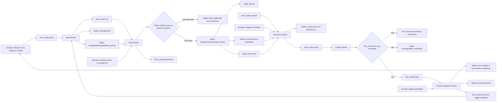

# Architecture Flow

```mermaid
flowchart LR
    RAW["Entrada: data/raw com imagens e labels"] --> QDATA["Fila: q.data.build"]
    QDATA --> DATA_WORKER["Data Worker"]
    DATA_WORKER --> DATASET["Saida: storage/datasets/dataset_version"]
    DATA_WORKER --> METADATA["Saida: metadata.json"]
    DATA_WORKER --> QTRAIN["Fila: q.train.run"]

    QTRAIN --> TRAIN_WORKER["Train Worker"]
    DATASET --> TRAIN_WORKER
    BASE_MODEL["Entrada: production.json ou models/v0"] --> TRAIN_WORKER

    TRAIN_WORKER --> GATE{"Gate: mAP50 maior ou igual ao baseline"}

    GATE -->|Nao aprovado| NOT_PROMOTED["Saida: treino registrado sem promocao"]

    GATE -->|Aprovado| MODEL_DIR["Saida: storage/models/model_version"]
    MODEL_DIR --> BEST_PT["Saida: best.pt"]
    MODEL_DIR --> BEST_ONNX["Saida: best.onnx"]
    MODEL_DIR --> PRODUCTION["Saida: production.json atualizado"]

    TRAIN_WORKER --> QPROMOTED["Fila: q.model.promoted"]

    QINFER["Fila: q.infer.request"] --> INFER_WORKER["Inference Worker"]
    STREAM_IMAGE["Entrada: imagem de stream"] --> INFER_WORKER
    PRODUCTION --> INFER_WORKER
    BEST_ONNX --> INFER_WORKER

    INFER_WORKER --> RESULTS["Saida: results.jsonl com inference_id"]
    INFER_WORKER --> QRESULT["Fila: q.infer.result"]

    QRESULT --> COLLECT_WORKER["Collect Worker"]
    COLLECT_WORKER --> CONF_CHECK{"min_conf menor que threshold"}

    CONF_CHECK -->|Nao| END_FLOW["Fim: nenhuma anotacao necessaria"]

    CONF_CHECK -->|Sim| CANDIDATES["Saida: storage/label_candidates"]
    CONF_CHECK -->|Sim| QLABEL["Fila: q.label.task"]

    QLABEL --> ORACLE_WORKER["Oracle Annotation Worker"]
    ORACLE_LABELS["Entrada: data/oracle/labels"] --> ORACLE_WORKER

    ORACLE_WORKER --> RAW_UPDATE["Saida: nova imagem e novo label em data/raw"]
    ORACLE_WORKER --> ANNOTATIONS["Saida: annotations.jsonl"]
    ORACLE_WORKER --> QFEEDBACK["Fila: q.data.build com trigger feedback"]

    QFEEDBACK --> DATA_WORKER
    RAW_UPDATE --> RAW
```